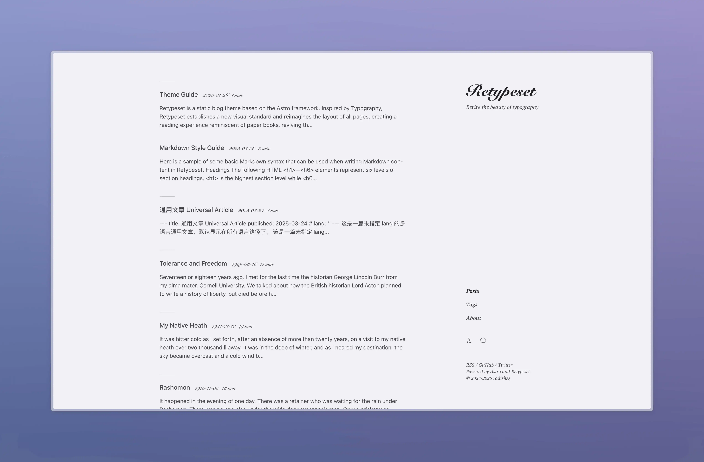

  <picture>
    <source media="(prefers-color-scheme: dark)"
            srcset="https://img.shields.io/badge/-English-4593F8?style=for-the-badge" />
    <source media="(prefers-color-scheme: light)"
            srcset="https://img.shields.io/badge/-English-0A69DA?style=for-the-badge" />
    
  </picture>
  

# Retypeset

Retypeset is a static blog theme based on the [Astro](https://astro.build/) framework. Inspired by [Typography](https://astro-theme-typography.vercel.app/), Retypeset establishes a new visual standard and reimagines the layout of all pages, creating a reading experience reminiscent of paper books, reviving the beauty of typography. Details in every sight, elegance in every space.

## Demo

- [Retypeset](https://retypeset.radishzz.cc/en/)
- [Retipografía](https://retypeset.radishzz.cc/es/)
- [Переверстка](https://retypeset.radishzz.cc/ru/)
- [重新编排](https://retypeset.radishzz.cc/)
- [重新編排](https://retypeset.radishzz.cc/zh-tw/)
- [再組版](https://retypeset.radishzz.cc/ja/)

## Features

- Built with Astro and UnoCSS
- Support for SEO, Sitemap, OpenGraph, TOC, RSS, MDX and KaTeX
- i18n support
- Light / Dark mode
- Elegant view transitions
- Rich theme customization
- Optimized typography
- Responsive design
- Comment system

## Performance

  <a href="https://pagespeed.web.dev/analysis?url=https%3A%2F%2Fretypeset.radishzz.cc%2F">
    
  <a>

## Deploy

1. Click [`Fork`](https://github.com/radishzzz/astro-theme-retypeset/fork) to clone this repository.

2. Click `Deploy to Netlify` or `Deploy to Vercel` below

&emsp;

3. Select the repository and click `Deploy`.

For other platforms, please refer to the [Astro Deployment Guides](https://docs.astro.build/en/guides/deploy/).

## Updates

1. Follow the [GitHub Docs](https://docs.github.com/en/pull-requests/collaborating-with-pull-requests/working-with-forks/syncing-a-fork) to run `Sync fork`.

2. Do not click `Discard Changes`.

## Documentation

- [Theme Guide](https://retypeset.radishzz.cc/en/posts/theme-guide/)
- [Theme Configuration File](https://github.com/radishzzz/astro-theme-retypeset/blob/master/src/config.ts)

## Credits

- [Typography](https://github.com/moeyua/astro-theme-typography)
- [Fuwriu](https://github.com/saicaca/fuwari)
- [Redefine](https://github.com/EvanNotFound/hexo-theme-redefine)
- [AstroPaper](https://github.com/satnaing/astro-paper)
- [heti](https://github.com/sivan/heti)
- [EarlySummerSerif](https://github.com/GuiWonder/EarlySummerSerif)

## Star History

<a href="https://star-history.com/#radishzzz/astro-theme-retypeset&Date">
  <picture>
    <source media="(prefers-color-scheme: dark)" srcset="https://api.star-history.com/svg?repos=radishzzz/astro-theme-retypeset&type=Date&theme=dark" />
    <source media="(prefers-color-scheme: light)" srcset="https://api.star-history.com/svg?repos=radishzzz/astro-theme-retypeset&type=Date" />
    
  </picture>

